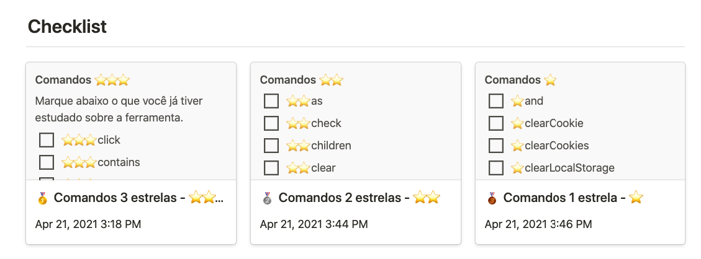

<h1 align="center">Cypress Learning Checklist</h1>

Acelere seu aprendizado sobre Cypress priorizando o que estudar primeiro.

Nosso dia tem 24hs, mas obviamente não temos 24hs disponíveis. Em geral:

- 8hs estamos trabalhando
- 8hs estamos dormindo
- 3hs estamos nos afazeres domésticos
- 5hs é o que sobra para alimentação, estudos, lazer.

Isso sem contar deslocamentos, família, imprevistos.

Todos os estes itens influenciam no tempo que temos (ou que não temos) para aprender algo novo. Por isso, de tempos em tempos eu costumo testar alguma técnica de aprendizado para entender qual seria a forma mais rápida e assertiva, caso tivesse que aprender o mesmo assunto de novo. Acredito que isso pode ajudar outras pessoas, por isso estou compartilhando o Cypress Learning Checklist.

O Cypress Learning Checklist é uma lista com comandos do Cypress organizados por ordem de prioridade. O critério adotado para essa priorização foi a frequência de uso destes comandos, considerando a minha experiência. Ficou assim:

- Comandos usados com frequência alta - 3 estrelas ⭐️⭐️⭐️
- Comandos usados com frequência moderada - 2 estrelas ⭐️⭐️
- Comandos usado com frequência baixa - 1 estrelas ⭐️

Pra te ajudar a lembrar o que já estudou ou não, criei  <strong><a href="https://www.notion.so/Cypress-Learning-Checklist-2e9ee8cd9b4e42809deedea597710079">esse template no Notion</a>.</strong> Use para te ajudar a revisar ⚡️ 

### Comandos ⭐️⭐️⭐️

- ⭐️⭐️⭐️ <a href="https://docs.cypress.io/api/commands/click">click</a>
- ⭐️⭐️⭐️ <a href="https://docs.cypress.io/api/commands/contains">contains</a>
- ⭐️⭐️⭐️ <a href="https://docs.cypress.io/api/commands/get">get</a>
- ⭐️⭐️⭐️ <a href="https://docs.cypress.io/api/commands/intercept">intercept</a>
- ⭐️⭐️⭐️ <a href="https://docs.cypress.io/api/commands/log">log</a>
- ⭐️⭐️⭐️ <a href="https://docs.cypress.io/api/commands/pause">pause</a>
- ⭐️⭐️⭐️ <a href="https://docs.cypress.io/api/commands/request">request</a>
- ⭐️⭐️⭐️ <a href="https://docs.cypress.io/api/commands/screenshot">screenshot</a>
- ⭐️⭐️⭐️ <a href="https://docs.cypress.io/api/commands/should">should</a>
- ⭐️⭐️⭐️ <a href="https://docs.cypress.io/api/commands/then">then</a>
- ⭐️⭐️⭐️ <a href="https://docs.cypress.io/api/commands/type">type</a>
- ⭐️⭐️⭐️ <a href="https://docs.cypress.io/api/commands/visit">visit</a>
- ⭐️⭐️⭐️ <a href="https://docs.cypress.io/api/commands/wait">wait</a>

### Comandos ⭐️⭐️

- ⭐️⭐️ <a href="https://docs.cypress.io/api/commands/as">as</a> 
- ⭐️⭐️ <a href="https://docs.cypress.io/api/commands/check">check</a>
- ⭐️⭐️ <a href="https://docs.cypress.io/api/commands/children">children</a>
- ⭐️⭐️ <a href="https://docs.cypress.io/api/commands/clear">clear</a>
- ⭐️⭐️ <a href="https://docs.cypress.io/api/commands/eq">eq</a>
- ⭐️⭐️ <a href="https://docs.cypress.io/api/commands/find">find</a>
- ⭐️⭐️ <a href="https://docs.cypress.io/api/commands/first">first</a>
- ⭐️⭐️ <a href="https://docs.cypress.io/api/commands/fixture">fixture</a>
- ⭐️⭐️ <a href="https://docs.cypress.io/api/commands/its">its</a>
- ⭐️⭐️ <a href="https://docs.cypress.io/api/commands/last">last</a>
- ⭐️⭐️ <a href="https://docs.cypress.io/api/commands/parent">parent</a>
- ⭐️⭐️ <a href="https://docs.cypress.io/api/commands/readFile">readFile</a>
- ⭐️⭐️ <a href="https://docs.cypress.io/api/commands/scrollIntoView">scrollIntoView</a>
- ⭐️⭐️ <a href="https://docs.cypress.io/api/commands/select">select</a>
- ⭐️⭐️ <a href="https://docs.cypress.io/api/commands/submit">submit</a>
- ⭐️⭐️ <a href="https://docs.cypress.io/api/commands/uncheck">uncheck</a>
- ⭐️⭐️ <a href="https://docs.cypress.io/api/commands/url">url</a>
- ⭐️⭐️ <a href="https://docs.cypress.io/api/commands/viewport">viewport</a>
- ⭐️⭐️ <a href="https://docs.cypress.io/api/commands/window">window</a>
- ⭐️⭐️ <a href="https://docs.cypress.io/api/commands/writeFile">writeFile</a>

### Comandos ⭐️

- ⭐️ <a href="https://docs.cypress.io/api/commands/and">and</a>
- ⭐️ <a href="https://docs.cypress.io/api/commands/clearCookie">clearCookie</a>
- ⭐️ <a href="https://docs.cypress.io/api/commands/clearCookies">clearCookies</a>
- ⭐️ <a href="https://docs.cypress.io/api/commands/clearLocalStorage">clearLocalStorage</a>
- ⭐️ <a href="https://docs.cypress.io/api/commands/each">each</a>
- ⭐️ <a href="https://docs.cypress.io/api/commands/getCookie">getCookie</a>
- ⭐️ <a href="https://docs.cypress.io/api/commands/getCookies">getCookies</a>
- ⭐️ <a href="https://docs.cypress.io/api/commands/go">go</a>
- ⭐️ <a href="https://docs.cypress.io/api/commands/invoke">invoke</a>
- ⭐️ <a href="https://docs.cypress.io/api/commands/next">next</a>
- ⭐️ <a href="https://docs.cypress.io/api/commands/prev">prev</a>
- ⭐️ <a href="https://docs.cypress.io/api/commands/reload">reload</a>
- ⭐️ <a href="https://docs.cypress.io/api/commands/route">route</a>
- ⭐️ <a href="https://docs.cypress.io/api/commands/server">server</a>
- ⭐️ <a href="https://docs.cypress.io/api/commands/siblings">siblings</a>
- ⭐️ <a href="https://docs.cypress.io/api/commands/spread">spread</a>
- ⭐️ <a href="https://docs.cypress.io/api/commands/trigger">trigger</a>

Lembrando que essa é uma lista *otimizada*. Logo, você deve priorizar os itens acima, e **quando** concluir os estudos passar a estudar os comandos abaixo. Ou, apenas ler brevemente o que faz cada um para ter consciência do uso.

Comandos não priorizados por enquanto:

blur,
clock,
closest,
dblclick,
debug,
document,
end,
exec,
filter,
focus,
focused,
hash,
hover,
location,
nextAll,
nextUntil,
not,
parents,
parentsUntil,
prevAll,
prevUntil,
rightclick,
root,
scrollTo,
setCookie,
shadow,
spy,
stub,
task,
tick,
title,
within,
wrap.

---

Pronto!

Você conseguiu aprender os comandos mais importantes do Cypress de forma organizada e priorizada.
Seu tempo agradece.

*Lembrando que essa lista é baseada em minha experiência como QA, em breve farei uma v2 baseada em pesquisa*

⭐️ Deixe o like ⭐️
